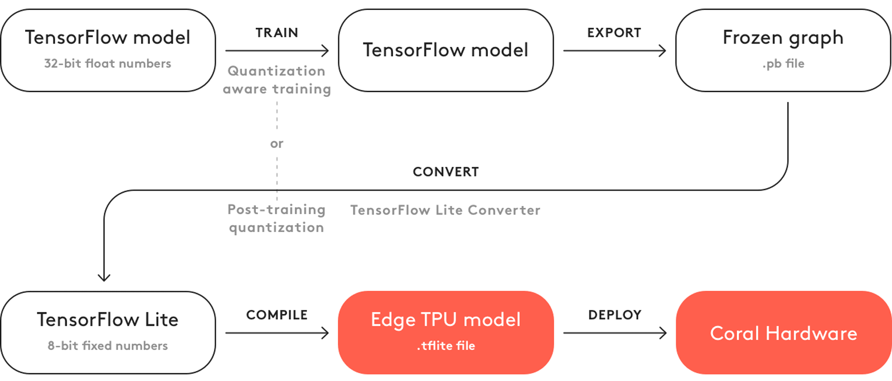

# Flow of Creating a Model

On this page, we are going to show how to create a model inherited from Tensorflow running on the Edge TPU. In short, the Edge TPU executes a deep feed-forward neural network and supports only Tensorflow Lite models that are fully 8-bit quantized and then compiled specifically for the Edge TPU. The following figure shows the basic flow of creating a model running on the edge TPU.



Refer to the Coral (2020), https://coral.ai/docs/edgetpu/models-intro/#compatibility-overview.

* In the first step, you have trained a model on the Tensorflow 1 (for now, the Edge TPU or Tensorflow Lite mainly supports Tensorflow 1).
* You can export the trained model as a serialized model format (`.pb`).
* You can further quantize the model or purge the model.
* After you create the quantized and purged model, you now can convert it to the Tensorflow Lite format (`.tflite`).
* In the final, you can compile the Tensorflow Lite model to the Edge TPU format, which is still a `.tflite` file.
* You now can deploy it to the Edge TPU and start the inference.


## An Example

```sh
docker pull tensorflow/tensorflow:1.15.4-py3-jupyter

docker run --rm --name tf -p 8887:8888 -v ~/Desktop/openimages_v4_ssd_mobilenet_v2_1:/tf/tfhub/model -d tensorflow/tensorflow:1.15.4-py3-jupyter
```

```sh
curl http://download.tensorflow.org/models/object_detection/ssd_mobilenet_v1_coco_2018_01_28.tar.gz -o ssd_mobilenet.tar.gz
```

